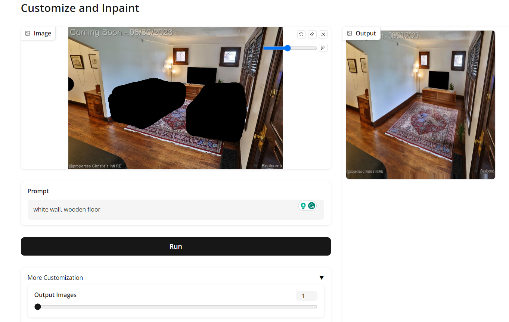
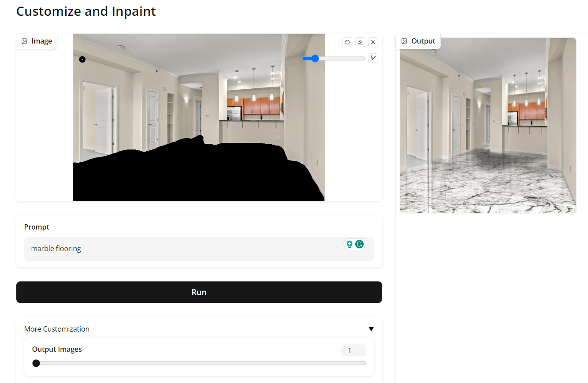
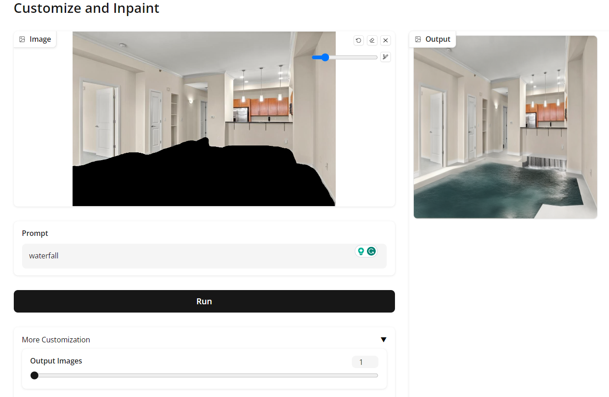
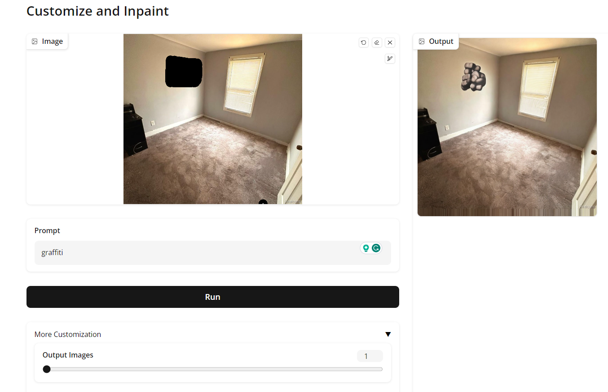
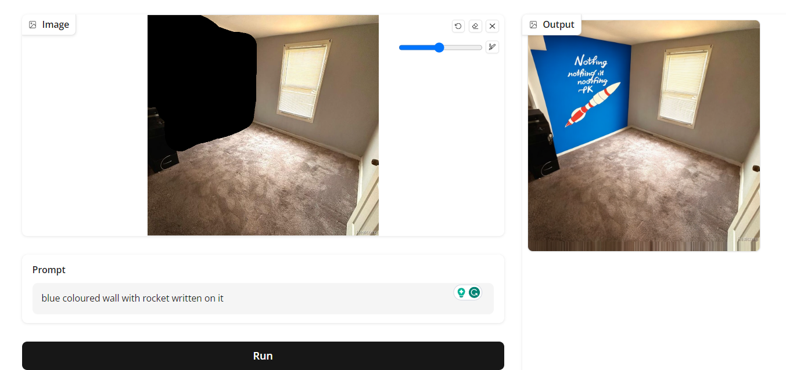
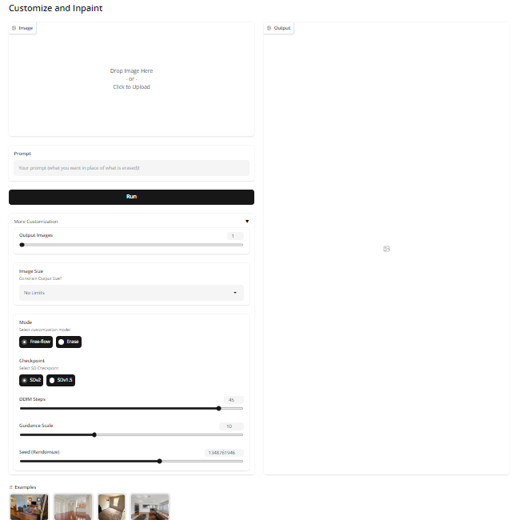
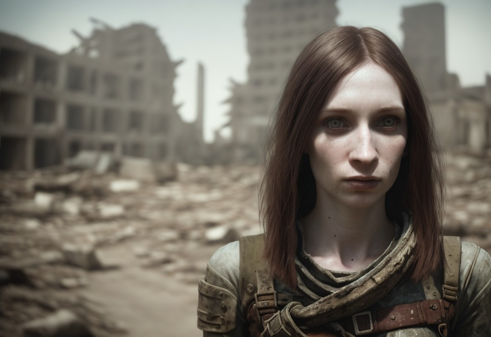
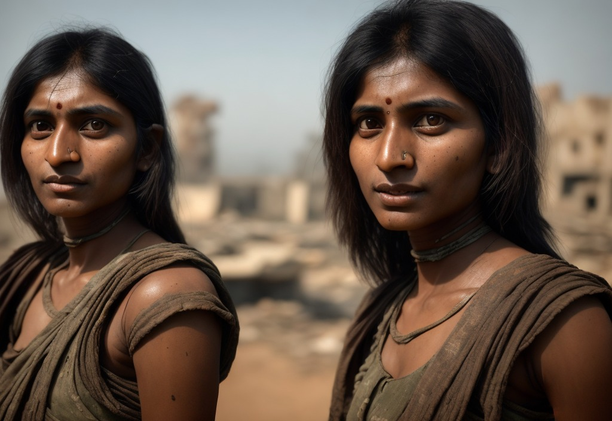
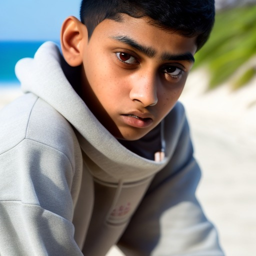
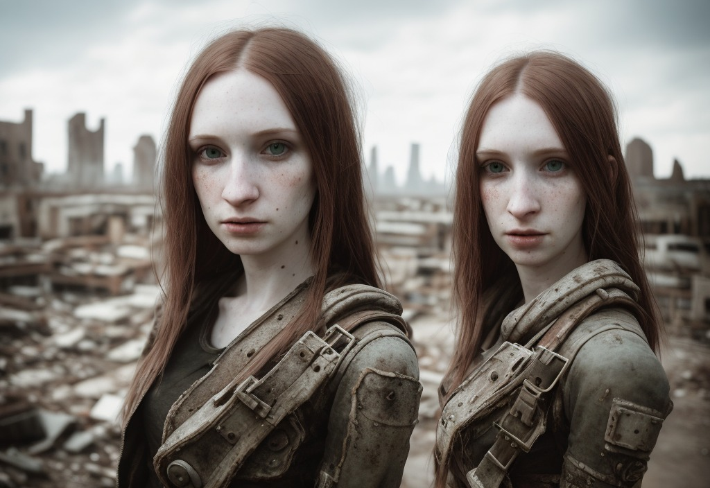

# Inpainting using Stable Diffusion Checkpoints

## How to run me?

### Minimum Requirements
* Atleast a V100 for a GPU, although an A100 (single/mutliple) with large vram would be preferable.
* Linux/Mac setup with python and conda

### Setup 
Initially, you would need to setup a conda enviroment with all the required packages. Go to the root directory of the project and set up and activate a conda environment as follows:

```
conda env create -f environment.yaml
conda activate inpaint

```

Install the following required packages in the environment:

```
conda install pytorch==1.12.1 torchvision==0.13.1 -c pytorch
pip install transformers==4.19.2 diffusers
pip install -e .

```

For a memory efficient and accelerated computation on your GPU you can install xformers as well. I had issues with the setup hence worked without the same. Dont install xformers through pip. Use the source github repo.

Once done with the setup, we can start the gradio script as follows:

*For Stable Diffusion v2*

```
sh run.sh v2

```

*For Stable Diffusion v1*

```
sh run.sh v1

```

## Some sample outputs

<div align="center">
    
    
    
    
    
    
</div>

## UI




## Gradio Demo guide

### General
* Obtain the image to customize and drag it to the input block or select the input block to upload the image
* You can also click on the examples to use an existing example image
* Then click on the paint-brush icon to mask the area you want to customize. Carefully mask the whole area without leaving any gaps. 
* Enter a prompt to replace the mask with your desired customization

### Advanced Customization

* Output Images: Control the number of output variations generated. Keep in mind to mind the load on the GPU
* Image Size: Incase computation in low you can use the constrained mode to limit size of the images yo 512x512
* Mode: Select erase to remove furniture else select free-flow 
* Checkpoint: Select your desired Stable Diffusion Checkpoint - 2 or 1.5
* Seed: Random-seed coressponding to the noisy vector generated. Think of it like a seed you can randomize
* DDIM: Denoising Steps. Higher is better but would would increase the model latency. Keep it above 20 for clean results
* Guidance: Weight of the guidance used for the prompts while computing cross-attention. Higher weight => Higher constrain based on the input prompt. Lower values give liberty to the model.

### Image Generation

By Experimenting with different SD Checkpoints, you can generate images as well. Just use a white 512x512 or any resolution image for that matter, inpaint the whole image and voila, you can do image generation! Some examples below:

<div align="center">
    
    
    
    
</div>


### Contact
*Kunal Kasodekar*